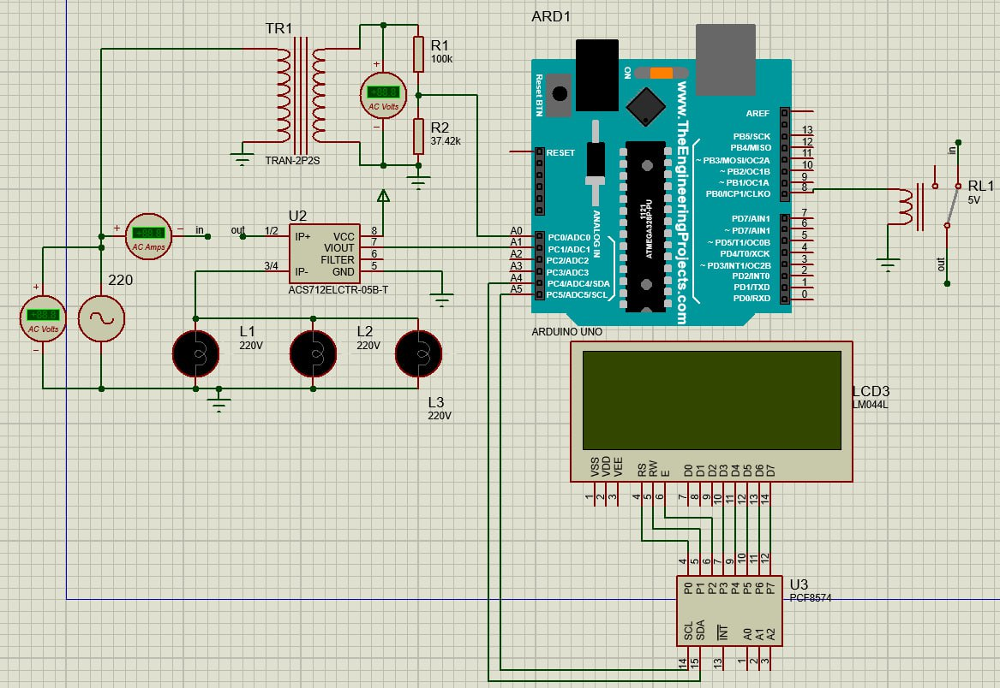
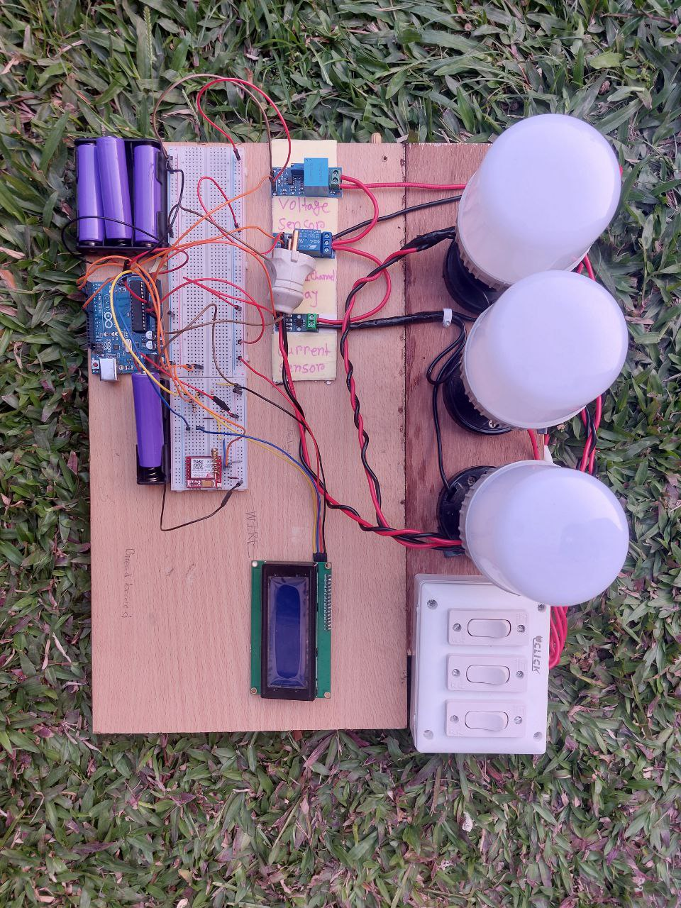

# GSM-Based-Smart-Prepaid-Energy-Meter-with-Recharging-System

## Overview
This repository contains the hardware and simulation codes for the Final Project of **EEE 306 (Power Systems I Laboratory)**.

The primary objective of this project is to reduce waiting times at energy billing counters and automatically restrict electricity usage if a consumer's prepaid balance is depleted. By utilizing GSM technology, the system can notify consumers of their power consumption and send alerts when the balance reaches a critical threshold. 

## Key Features
* **Real-Time Monitoring:** Precisely measures voltage, current, and total power consumption using dedicated analog sensors.
* **Local Display:** Visualizes real-time power metrics and the remaining account balance on a 20x4 LCD screen.
* **GSM Remote Recharge:** Allows the power utility or user to remotely recharge the meter's balance via SMS utilizing a SIM800L module.
* **Automated Load Switching:** Automatically disconnects the consumer load using a relay when the prepaid balance drops below zero, and reconnects it once recharged.
* **Low Balance Alerts:** Automatically sends an SMS notification to a designated phone number when the account balance is insufficient.

## Hardware Components
The system hardware is built around the Arduino ecosystem. The core components include:
* **Microcontroller:** Arduino Uno R3 
* **Communication:** SIM800L Mini GPRS GSM Module 
* **Voltage Measurement:** ZMPT101B Voltage Sensor 
* **Current Measurement:** ACS712-30A Current Sensor 
* **Display:** 20x4 LCD Module with I2C adapter 
* **Switching:** 5V Single Channel Latching Relay 
* **Power Supply:** Lithium-ion batteries (3pcs) with Charging Module and Buck Converters 

## Software Dependencies
The firmware is written in C++ using the Arduino IDE. The following libraries must be installed to compile the code:
* `Wire.h` (Standard I2C library) 
* `SoftwareSerial.h` (For SIM800L communication) 
* `LiquidCrystal_I2C.h` 
* `ACS712.h` 
* `ZMPT101B.h` 

## System Architecture & Simulation
Before hardware assembly, the complete circuit was designed and validated using **Proteus Simulation software**. 

## Hardware Implementation
The final assembled hardware integrates the microcontroller, sensors, GSM module, and display into a cohesive prototype unit.

## Limitations
During testing and evaluation, a few hardware limitations were observed:
* The ACS712 (30A) sensor exhibited decreased accuracy when measuring very low-current loads.
* The system calculates power based on RMS voltage and current but does not currently measure the power factor, meaning energy calculations assume a purely resistive load.
* The compact antenna on the SIM800L module occasionally resulted in dropped GSM connections.

## Future Work
* **Power Factor Measurement:** Upgrading the sampling logic to measure the delay between voltage and current peaks to account for non-resistive loads.
* **IoT Dashboard Integration:** Connecting the system to Wi-Fi to provide users with a web-based interface for data tracking.
* **Theft Detection:** Implementing intelligent algorithms to track anomalies in power usage patterns.
* **Renewable Integration:** Allowing the system to account for back-fed power from solar panels.
